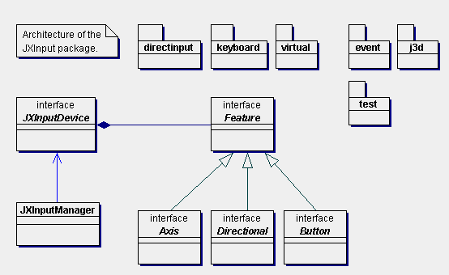

Fork of <http://drts.cvs.sourceforge.net/viewvc/drts/projects/jxinput/>, see <http://www.hardcode.de/jxinput/>.

----------

JXInput - Input Devices for Java
================

Java as it comes in the common distribution does not provide any means to access typical gaming devices like joysticks, gamepads and such.

But many people out there are actually using Java for writing games! Imagine a flight simulator without a joystick, a sports game without a gamepad, a racing game without a steering wheel.

For the Java community is typically very active I was wondering whether there are not [zillions](http://www.hardcode.de/jxinput/jxlinks.html) of extensions contributed by the community. Well, I found a few, but none of them reflected the complexity and the possibilities of state-of-the-art input devices we find today.

## Technique ##

As long as JXInput is used in a way that it just uses common Java features (see KeyboardDevice/VirtualDevice), JXInput is a 100% pure Java library.

But for Java does not support joysticks in a portable fashion, the binding to physical devices has to be done in a platform dependent manner. So system specific libraries come into play and the 100% pure Java beauty is gone. This also means that applications using JXInput then cannot be simple Applets, but always have to take precauti[ons concerning download, installation and security. ](http://www.java.sun.com/cgi-bin/javawebstart-platform.sh?)Sun's WebStart technology is a suitable mechanism to bring even these kind of libraries to the people at home.

The current implementation connects to devices using Microsoft DirectInput (DirectX8) and reflects the features, but not the design of that commonly used library. 
This may be extended in the future, because the design of the package is not Win32 specific and it should be quite easy to add other native support libraries e.g. for Linux or MacOS.

For the platforms that cannot be supported by the DirectInput binding such as MacOS or Linux, JXInput offers means to query the Swing keyboard an emulate the desired joystick functions.

BTW, the native Win32 library works standalone as well providing an easy-to-use wrapper around DirectInput devices.

## Features ##
JXInput gives access to any number of DirectInput gaming devices - although it seems to be quite unusual to have more than one connected.
Additionally, JXInput allows to interpret each key on the keyboard as interpreted by Swing to be a JXInput button. This gives another source for about 100 additional buttons.

For computer without a phyisical joystick attached, JXInput offers the possibility to emulate 'virtual' joystick axes with help from a set of buttons. So it is very easy to use a 'virtual' joystick by using the e.g. the cursor keys.

For each device, the following features are supported:

- 6	axis (3 translational, 3 rotational)
- 2	sliders
- 4	directional devices; coolie hats
- 256 buttons

JXInput allows to ask for the features available with a given device and later to query their respective values. This is the way most games work, polling the state of the inputdevice within a loop.

For event driven applications, JXInput allows to register 'listener' objects with the features. This way, the application is called back by JXInput in case the input device changes it's state.

There also is a third mode of operation allowing JXInput to be used with Java3D. In order to be able to work in a Java3D environment, JXInput implements the predefined interface javax.media.j3d.InputDevice. So JXInput can be added to existing Java3D projects without breaking the code.

## Performance ##

JXInput uses JNI (Java Native Interface) to access the native library. JNI is not known to be too fast, so the number of calls has been minimized: 1. The polling of the devices state is managed by JXInput in a single JNI call. 
Another possible performance drain is the allocation and deallocation of objects. Therefore, after being setup, JXInput does no longer create any objects at all.